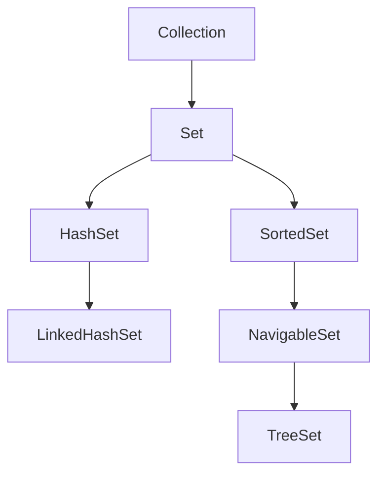
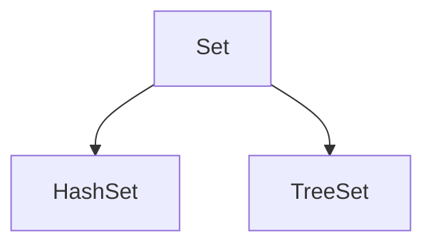
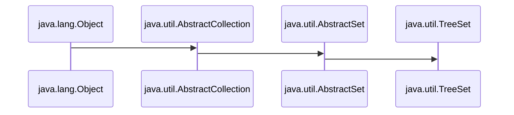
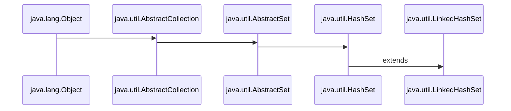
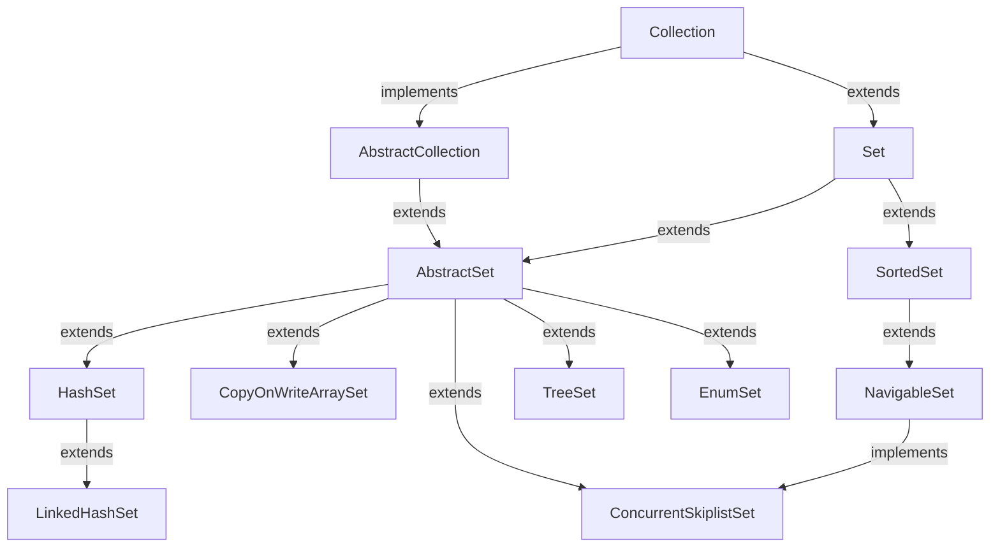

# JavaCollectionFramework
This is all about Java Collection.


<h3> <i> java.util </i> →Package contains  the collection classes let us to group elements in various ways . The Collection Classes also define several methods that provide easier way of working with items . These classes are important , not just for their but because many other Java methods use or return objects of these classes such as the <i>ArrayList</i> and <i>HashMap</i> classes. Collection package added to JSE 1.2 Java SE 8 has significantly increased the power and streamlined the use of collection framework. </h3>

<h2> <ins> The Collection Framework Interfaces </ins></h2>
<ul>
  <li><h3>1.Collection</h3> </li>
  <li><h3>2.Deque</h3> </li>
  <li><h3>3.List</h3> </li>
  <li><h3>4.Set</h3> </li>
  <li><h3>5.Map</h3> </li>
  <li><h3>6.Sorted Set</h3> </li>
  <li><h3>7.Sorted Map</h3> </li>
  <li><h3>8.Queue</h3> </li>
  <li><h3>9.Navigable Set</h3> </li>
</ul>

<h2> <ins>1. The Collection Interface </ins> </h2>

<br>
  
```Syntax

Collection: It is the top of the collection hierarchy. It supports basic grouping of elements.

```
<h3>The Collection interface is the foundation upon which the Collections Framework is built because it must be implemented by any class that defines a collection.Collection is a generic interface that has this declaration:</h3>

<h3 align="center">
 
 ```Syntax
 
 interface Collection<E>
 
 ```

</h3>

<h3> Here E specifies the type of objects that the Collection will hold. Consider an example: </h3>

<h3 align="center">
 
 ```Syntax
 
 Collection<String> co
 
 ```

</h3>

<h3>The above example can be a List, a Set, or another kind of Collection.</h3>

<ul>
<ul>
<h3><a href= "https://github.com/AvinandanBose/JavaCollectionFramework/blob/main/javacollection1.java" > Java Collection [Eg -1]</a></h3>
<h3><a href= "https://github.com/AvinandanBose/JavaCollectionFramework/blob/main/javacollection2.java" > Java Collection [Eg -2]</a></h3>
<h3><a href= "https://github.com/AvinandanBose/JavaCollectionFramework/blob/main/javacollection3.java" > Java Collection [Eg -3]</a></h3>
<h3><a href= "https://github.com/AvinandanBose/JavaCollectionFramework/blob/main/javacollection4.java" > Java Collection [Eg -4]</a></h3>
</ul>

<table>
 <tr>
    <th>Interface</th>
    <th>Hash Table</th>
    <th>Resizable Array</th> 
   <th>Balanced Tree</th> 
   <th>Linked List</th> 
</tr> 
<tr>
  <td >Collection</td>
  <td >HashSet</td> 
  <td >ArrayList</td> 
  <td >TreeSet</td>
  <td >Linked List</td>
</tr>
</table>
  
<h3>  
 
```Syntax

That is we can create an instance of HashSet, ArrayList, TreeSet 
and LinkedList Class,through the help of Collection interface.


```

<h2> <ins> 2 . Sets </ins></h2>  
  
  


  ```Syntax

Collection: It is the top of the collection hierarchy. It supports basic grouping of elements.
  
Set: It extends Collection to implement sets, in which all elements must be unique.
  
SortedSet: It extends Set to implement a sorted set.
  
HashSet:  It extends Set to implement a hash set.

LinkedListSet:   It extends HashSet to implement a Linked List Set.

NavigableSet:   It extends SortedSet to implement a Navigable Set.
  
Tree Set:   It extends NavigableSet to implement a Tree Set.
```


  
<table>
 <tr>
    <th>Interface</th>
    <th>Hash Table</th>
    <th>Resizable Array</th> 
   <th>Balanced Tree</th> 
   <th>Linked List</th> 
</tr> 
<tr>
  <td >Set</td>
  <td >HashSet</td> 
  <td ></td> 
  <td >TreeSet</td>
  <td ></td>
</tr>
</table>  

<ul>
<h3><a href= "https://github.com/AvinandanBose/JavaCollectionFramework/blob/main/setDemo.java" > Set→HashSet [Eg -1]</a></h3>
<h3><a href= "https://github.com/AvinandanBose/JavaCollectionFramework/blob/main/setDemo1.java" >  Set→TreeSet  [Eg -2]</a></h3>


```Syntax

That is we can create an instance of TreeSet, HashSet,
through the help of Set Interface.

:HashSet:
___________
→It implements Set Interface.
→ Every elements entered are unique i.e. No duplicates.
→ HashSet stores the elements by using a mechanism called hashing.
→ HashSet allows null value.
→ HashSet doesn't maintain the insertion order. 
  Here, elements are inserted on the basis of their hashcode.
  
:TreeSet:
___________
→It implements Set Interface.
→TreeSet class access and retrieval times are quiet fast.
→TreeSet class doesn't allow null element.
→TreeSet class maintains ascending order. 
→TreeSet class contains unique elements only like HashSet.
```

<h2> Calculation of HashCode  </h3>
<ul>
<li><h3> 1. Integers </h3> </li>
<ul>
<h3><a href= "https://github.com/AvinandanBose/JavaCollectionFramework/blob/main/hashcodeDemo1.java" > HashCode Of Integers [Eg -1]</a></h3>
</ul>
<li><h3> 2. Strings </h3> </li>
<ul>
<h3><a href= "https://github.com/AvinandanBose/JavaCollectionFramework/blob/main/hashcodeDemo2.java" > HashCode Of Strings [Eg -2]</a></h3>
</ul>


```Syntax

:HASH CODE OF INTEGERS:

HASH CODE OF 1 → 1
HASH CODE OF 2 → 2
HASH CODE OF 3 → 3

                  ......etc.
                  
:HASH CODE OF STRINGS:

HASH CODE OF A → 65 //ASCII CODE
HASH CODE OF B → 66 //ASCII CODE
HASH CODE OF C → 67 //ASCII CODE
                    ......etc.

```

</ul>
  
<h1 align="center">  HashSet Functionality:  </h1>
 <ul>
   <li> <h3> 1. Add </h3> </li>
   <ul>
     <h3><a href= "https://github.com/AvinandanBose/JavaCollectionFramework/blob/main/HashSetDemo.java" > HashSet [Add]</a></h3>
    </ul>
    
```Syntax
      Adds the specified element to this set if it is not already present. 
     More formally, adds the specified element e to this set if this set ,
     contains no element e2 such that Objects.equals(e, e2). 
     If this set already contains the element, the call leaves 
     the set unchanged and returns false.     
````

    
    
<li> <h3> 2. Remove </h3> </li>
   <ul>
     <h3><a href= "https://github.com/AvinandanBose/JavaCollectionFramework/blob/main/HashSetDemo1.java" > HashSet [Remove]</a></h3>
    </ul>
    
```Syntax
      Removes the specified element from this set if it is present. 
      More formally, removes an element e such that Objects.equals(o, e), 
      if this set contains such an element. 
      Returns true if this set contained the element.     
````

<li> <h3> 3. Clear </h3> </li>
   <ul>
     <h3><a href= "https://github.com/AvinandanBose/JavaCollectionFramework/blob/main/HashSetDemo2.java" > HashSet [Clear]</a></h3>
    </ul>
 
 ```Syntax
      Removes all of the elements from this set. 
      The set will be empty after this call returns. 
````
    
   <li> <h3> 4. Clone </h3> </li>
   <ul>
     <h3><a href= "https://github.com/AvinandanBose/JavaCollectionFramework/blob/main/HashSetDemo3.java" > HashSet [Clone]</a></h3>
    </ul>
    
```Syntax
      Returns a shallow copy of this HashSet instance: the elements themselves are not cloned.
````    
    
<li> <h3> 5. Iterator </h3> </li>
   <ul>
     <h3><a href= "https://github.com/AvinandanBose/JavaCollectionFramework/blob/main/HashSetDemo4.java" > HashSet [Iterator]</a></h3>
     <ul>
     
```Syntax
      Iterator: It iterates over the elements in the set. 
      The elements are returned in no particular order.
      
      Note: The double colon (::) operator, 
      also known as method reference operator.
      
      →Double Colon Operator is used to call a method,
      by referring to it with the help of its class directly.
````

<li><h3>a. HashSet [Iterator] → For Each Remaining</a></h3></li>
     <ul>
        <li><h3><a href= "https://github.com/AvinandanBose/JavaCollectionFramework/blob/main/HashSetDemo5.java" > For Each Remaining</a></h3></li>
     </ul>
     
```Syntax
     Performs the given action for each remaining element,
     until all elements have been processed or
     the action throws an exception. Actions are performed,
     in the order of iteration, if that order is specified. 
     Exceptions thrown by the action are relayed to the caller.
````

<li><h3>b. HashSet [Iterator] → hasNext</a></h3></li>
     <ul>
        <li><h3><a href= "https://github.com/AvinandanBose/JavaCollectionFramework/blob/main/HashSetDemo6.java" > hasNext</a></h3></li>
     </ul>
     
```Syntax
    Returns true if the iteration has more elements. 
    (In other words, returns true if next would return ,
    an element rather than throwing an exception.)
```` 

<li><h3>c. HashSet [Iterator] →Next</a></h3></li>
     <ul>
        <li><h3><a href= "https://github.com/AvinandanBose/JavaCollectionFramework/blob/main/HashSetDemo7.java" > Next</a></h3></li>
       <ul>
       
```Syntax
   Returns the next element in the iteration.
````

<li><h3>Next.CompareTo</h3></li>
         <ul>
           <li><h3><a href= "https://github.com/AvinandanBose/JavaCollectionFramework/blob/main/HashSetDemo9.java" >Next.CompareTo</a></h3></li>
         </ul>
         
```Syntax
  Compares two Integer objects numerically.
````

</ul>
</ul>
     

<li><h3>d. HashSet [Iterator] →remove</a></h3></li>
     <ul>
        <li><h3><a href= "https://github.com/AvinandanBose/JavaCollectionFramework/blob/main/HashSetDemo8.java" > Remove</a></h3></li>
     </ul>
     
```Syntax
  Removes from the underlying collection the last element,
  returned by this iterator (optional operation).
  This method can be called only once per call to next.
````

</ul>
<li><h3>6. HashSet →[Union]AddAll</h3></li>
<ul>
  <li><h3><a href= "https://github.com/AvinandanBose/JavaCollectionFramework/blob/main/HashSetDemo10.java" > [Union]AddAll</a></h3></li>
</ul>

```Syntax
 Adds all of the elements in the specified collection to this ,
 set if they're not already present (optional operation). 
 If the specified collection is also a set, the addAll operation,
 effectively modifies this set so that its value is the union of the two sets. 
 The behavior of this operation is undefined,
 if the specified collection is modified while the operation is in progress.
````

<li><h3>7. HashSet →[Intersection]RetainAll</h3></li>
<ul>
  <li><h3><a href= "https://github.com/AvinandanBose/JavaCollectionFramework/blob/main/HashSetDemo11.java" > [Intersection]RetainAll</a></h3></li>
</ul>

```Syntax
 Retains only the elements in this collection that are contained,
 in the specified collection (optional operation)[Intersection]. In other words, 
 removes from this collection all of its elements that are not ,
 contained in the specified collection.
````

<li><h3>8. HashSet →Spliterator</h3></li>
<ul>
  <li><h3><a href= "https://github.com/AvinandanBose/JavaCollectionFramework/blob/main/HashSetDemo12.java" > Spliterator</a></h3></li>
</ul>

```Syntax
 Returns a Spliterator over the elements in this set.
 Creates a late-binding and fail-fast Spliterator,
 over the elements in this set.A late-binding Spliterator,
 binds to the source of elements means HashSet,
 at the point of first traversal, first split,
 or first query for estimated size, 
 rather than at the time the Spliterator is created.
 ````
<li><h3>9. HashSet →Contains</h3></li>

<ul>
  <li><h3><a href= "https://github.com/AvinandanBose/JavaCollectionFramework/blob/main/HashSetDemo13.java" > Contains</a></h3></li>
</ul>

```Syntax
 Returns true if this set contains the specified element. 
 More formally, returns true if and only if this set contains,
 an element e such that Objects.equals(o, e).
 ````
 
<li><h3>10. HashSet →Size</h3></li>

<ul>
  <li><h3><a href= "https://github.com/AvinandanBose/JavaCollectionFramework/blob/main/HashSetDemo20.java" > Size</a></h3></li>
</ul>

```Syntax
 Returns the number of elements in this set (its cardinality).
 ````

<li><h3>11. HashSet →isEmpty</h3></li>

<ul>
  <li><h3><a href= "https://github.com/AvinandanBose/JavaCollectionFramework/blob/main/HashSetDemo21.java" >isEmpty</a></h3></li>
</ul>

```Syntax
 Returns true if this set contains no elements.
 ````

<h2>  </h2>

<li><h3>12. HashSet →ContainsAll</h3></li>

<ul>
  <li><h3><a href= "https://github.com/AvinandanBose/JavaCollectionFramework/blob/main/HashSetDemo14.java" > ContainsAll</a></h3></li>
</ul>

```Syntax
From: java.util.AbstractCollection 

Def: Returns true if this collection contains all of the elements,
in the specified collection.

````


<li><h3>13. HashSet →RemoveAll</h3></li>

<ul>
  <li><h3><a href= "https://github.com/AvinandanBose/JavaCollectionFramework/blob/main/HashSetDemo15.java" > RemoveAll</a></h3></li>
</ul>

```Syntax

From: java.util.AbstractSet

Def: Removes from this set all of its elements ,
that are contained in the specified collection (optional operation). 
If the specified collection is also a set, this operation effectively modifies,
this set so that its value is the asymmetric set difference of the two sets.

This implementation determines which is the smaller of this set and the specified collection, 
by invoking the size method on each. If this set has fewer elements, then the implementation ,
iterates over this set, checking each element returned by the iterator,
in turn to see if it is contained in the specified collection.


````

<li><h3>14. HashSet →RemoveIf</h3></li>

<ul>
  <li><h3><a href= "https://github.com/AvinandanBose/JavaCollectionFramework/blob/main/HashSetDemo16.java" > RemoveIf</a></h3></li>
</ul>

```Syntax

From: java.util.Collection

Def: Removes all of the elements of this collection that satisfy the given predicate. 
Errors or runtime exceptions thrown during iteration or ,
by the predicate are relayed to the caller.


````

<li><h3>15. HashSet →Stream</h3></li>

<ul>
  <li><h3><a href= "https://github.com/AvinandanBose/JavaCollectionFramework/blob/main/HashSetDemo17.java" > Stream</a></h3></li>
  

</ul>

```Syntax

From: java.util.Collection

Def: Returns a sequential Stream with this collection as its source.

````
<ul>
<ul>
<li><h3>1. flatMapToDouble/Long/Int</h3></li>
<ul>
 <li><h3><a href= "https://github.com/AvinandanBose/JavaCollectionFramework/blob/main/HashSetDemo15a.java" > flatMapToDouble/Long/Int</a></h3></li>
</ul>
<li><h3>2. mapToDouble/Long/Int</h3></li>
<ul>
 <li><h3><a href= "https://github.com/AvinandanBose/JavaCollectionFramework/blob/main/HashSetDemo15aa.java" > mapToDouble/Long/Int</a></h3></li>
</ul>
<li><h3>3. collect(Collectors.toMap())</h3></li>
<ul>
 <li><h3><a href= "https://github.com/AvinandanBose/JavaCollectionFramework/blob/main/HashSetDemo15b.java" >collect(Collectors.toMap())</a></h3></li>
</ul>
<li><h3>4. allMatch</h3></li>
<ul>
 <li><h3><a href= "https://github.com/AvinandanBose/JavaCollectionFramework/blob/main/HashSetDemo15c.java" >allMatch</a></h3></li>
</ul>
<li><h3>5. anyMatch</h3></li>
<ul>
 <li><h3><a href= "https://github.com/AvinandanBose/JavaCollectionFramework/blob/main/HashSetDemo15d.java" >anyMatch</a></h3></li>
</ul>
<li><h3>6. noneMatch</h3></li>
<ul>
 <li><h3><a href= "https://github.com/AvinandanBose/JavaCollectionFramework/blob/main/HashSetDemo15e.java" >noneMatch</a></h3></li>
</ul>
<li><h3>7. dropWhile</h3></li>
<ul>
 <li><h3><a href= "https://github.com/AvinandanBose/JavaCollectionFramework/blob/main/HashSetDemo15g.java" >dropWhile</a></h3></li>
</ul>
<li><h3>8. distinct</h3></li>
<ul>
 <li><h3><a href= "https://github.com/AvinandanBose/JavaCollectionFramework/blob/main/HashSetDemo15h.java" >distinct</a></h3></li>
</ul>
<li><h3>9. spliterator  </h3></li>
<ul>
<li><h3>9.a. spliterator().hasCharacteristics(Spliterator.ORDERED/DISTINCT/SORTED/SIZED/SUBSIZED/NONNULL/IMMUTABLE/CONCURRENT)  </h3></li>
<ul>
 <li><h3><a href= "https://github.com/AvinandanBose/JavaCollectionFramework/blob/main/HashSetDemo15i.java" >spliterator().hasCharacteristics()</a></h3></li>
</ul>
<li><h3>9.b. spliterator().tryAdvance()  </h3></li>
<ul>
 <li><h3><a href= "https://github.com/AvinandanBose/JavaCollectionFramework/blob/main/HashSetDemo15f.java" >spliterator().tryAdvance()</a></h3></li>
</ul>
</ul>
<li><h3>10. iterator  </h3></li>
<ul>
 <li><h3><a href= "https://github.com/AvinandanBose/JavaCollectionFramework/blob/main/HashSetDemo15j.java" >iterator</a></h3></li>
</ul>
<li><h3>11. isParallel </h3></li>
<ul>
 <li><h3><a href= "https://github.com/AvinandanBose/JavaCollectionFramework/blob/main/HashSetDemo15k.java" >isParallel</a></h3></li>
</ul>
<li><h3>12. findFirst </h3></li>
<ul>
 <li><h3><a href= "https://github.com/AvinandanBose/JavaCollectionFramework/blob/main/HashSetDemo15l.java" >findFirst</a></h3></li>
</ul>

<li><h3>13. filter</h3></li>
<ul>
 <li><h3><a href= "https://github.com/AvinandanBose/JavaCollectionFramework/blob/main/HashSetDemo15m.java" >filter</a></h3></li>
</ul>
</ul>
</ul>

<li><h3>16. HashSet →ParallelStream</h3></li>

<ul>
  <li><h3><a href= "https://github.com/AvinandanBose/JavaCollectionFramework/blob/main/HashSetDemo18.java" > ParallelStream</a></h3></li>
</ul>


```Syntax

From: java.util.Collection

Def: Returns a possibly parallel Stream with this collection as its source. 
It is allowable for this method to return a sequential stream.

````
<h3> <i><ins>Note</ins>:Parallel Stream has similar functions like Streams. </i></h3> 

<li><h3>17. HashSet →toArray</h3></li>

<ul>
  <li><h3><a href= "https://github.com/AvinandanBose/JavaCollectionFramework/blob/main/HashSetDemo19.java" > toArray</a></h3></li>
</ul>

```Syntax

From: java.util.Collection

Def: Returns an array containing all of the elements in this collection; 
the runtime type of the returned array is that of the specified array. 
If the collection fits in the specified array, it is returned therein. 
Otherwise, a new array is allocated with the runtime type of the specified array 
and the size of this collection.

````

<li><h3>18. HashSet →equals</h3></li>

<ul>
  <li><h3><a href= "https://github.com/AvinandanBose/JavaCollectionFramework/blob/main/HashSetDemo22.java" > Equals</a></h3></li>
</ul>

```Syntax

From: java.util.AbstractSet

Def: Compares the specified object with this set for equality. 
Returns true if the given object is also a set, 
the two sets have the same size, 
and every member of the given set is contained in this set. 

````

<li><h3>19. HashSet →toString</h3></li>

<ul>
  <li><h3><a href= "https://github.com/AvinandanBose/JavaCollectionFramework/blob/main/HashSetDemo23.java" > toString</a></h3></li>
</ul>

```Syntax

From: java.util.AbstractCollection

Def: Converts the set to string and returns the collection.

````

<li><h3>19. HashSet →hashCode</h3></li>

<ul>
  <li><h3><a href= "https://github.com/AvinandanBose/JavaCollectionFramework/blob/main/HashSetDemo24.java" > HashCode</a></h3></li>
</ul>

```Syntax

From: java.util.AbstractSet

Def: Returns the hash code value for this set. 
The hash code of a set is,
defined to be the sum of the hash codes of the elements in the set, 
where the hash code of a null element is defined to be zero. 

````

<h2>  </h2>

</ul>
    


<h1>Abstract Set </h1>
<ul>
<li><h3><a href= "https://github.com/AvinandanBose/JavaCollectionFramework/blob/main/AbstractSetDemo.java" > AbstractSet</a></h3></li>

```Syntax
 We can create instance of HashSet from Abstract Set.
 AbstractSet class in Java is a part of the Java Collection Framework,
 which implements the Collection interface and extends,
 the AbstractCollection class. It provides a skeletal implementation,
 of the Set interface. 
 ````
 
</ul>


<h1>Abstract Collection </h1>
<ul>
<li><h3><a href= "https://github.com/AvinandanBose/JavaCollectionFramework/blob/main/AbstractCollectionDemo.java" > Abstract Collection</a></h3></li>

```Syntax
 We can create instance of HashSet from Abstract Collection.
 The AbstractCollection class in Java is a part of the ,
 Java Collection Framework and implements the Collection interface. 
 It is used to implement an unmodifiable collection, 
 for which one needs to only extend this AbstractCollection Class 
 and implement only the iterator and the size methods. 
 ````
 
</ul>

<h1>Object[java.lang.Object] </h1>
<ul>
<li><h3><a href= "https://github.com/AvinandanBose/JavaCollectionFramework/blob/main/ObjectSetDemo.java" > Object[java.lang.Object]-1</a></h3></li>
<li><h3><a href= "https://github.com/AvinandanBose/JavaCollectionFramework/blob/main/ObjectSetDemo1.java" > Object[java.lang.Object]-2</a></h3></li>

```Syntax
 We can create instance of HashSet from Object → [java.lang.Object].
 ````
 
</ul>


  </ul>
</ul>

</h3>
<h1 align="center">  TreeSet Functionality:  </h1>


<h3> Def: Java TreeSet class implements the Set interface that uses a tree for storage. It inherits AbstractSet class and implements the NavigableSet interface and SortedSet interface. The objects of the TreeSet class are stored in ascending order. </h3>

<table>
 <tr>
    <th>Interface</th>
    <th>Hash Table</th>
    <th>Resizable Array</th> 
   <th>Balanced Tree</th> 
   <th>Linked List</th> 
</tr> 
<tr>
  <td >Set</td>
  <td >HashSet</td> 
  <td ></td> 
  <td >TreeSet</td>
  <td ></td>
</tr>
 <td >NavigableSet</td>
  <td ></td> 
  <td ></td> 
  <td >TreeSet</td>
  <td ></td>
</tr>
</tr>
 <td >SortedSet</td>
  <td ></td> 
  <td ></td> 
  <td >TreeSet</td>
  <td ></td>
</tr>
</table>  

<ul>
<li><h3><a href= "https://github.com/AvinandanBose/JavaCollectionFramework/blob/main/TreeSetDemo1.java" > NavigableSet→TreeSet</a></h3></li>
<li><h3><a href= "https://github.com/AvinandanBose/JavaCollectionFramework/blob/main/TreeSetDemo2.java" > Set→TreeSet</a></h3></li>
 <li><h3><a href= "https://github.com/AvinandanBose/JavaCollectionFramework/blob/main/TreeSetDemo3.java" >SortedSet→TreeSet</a></h3></li>
</ul>

<h3> Continuing...: Java TreeSet class implements most of the functions that Hash Set uses as given below: </h3>

<ul>
<li><h3><a href= "https://github.com/AvinandanBose/JavaCollectionFramework/blob/main/TreeSetDemo.java" > Tree Set Functions-1(From HashSet)</a></h3></li>
</ul>

<h3> Continuing...: As TreeSet implements Set , Navigable Set  and SortedSet interface , hence it uses  functions of Set , NavigableSet and SortedSet interface. </h3>

<h3><i><ins> Extras<ins></i> </h3>
<ul>
<li><h3><a href= "https://github.com/AvinandanBose/JavaCollectionFramework/blob/main/TreeSetDemo4.java" >Ceiling</a></h3></li>
  
```Syntax
 It takes Float value in the Function.
 Returns the least element in this set greater than or equal to the given element, 
 or null if there is no such element. 
 It returns the Ceil value of the Float Value ,entered in the ceiling function.
 ````
 
 <li><h3><a href= "https://github.com/AvinandanBose/JavaCollectionFramework/blob/main/TreeSetDemo5.java" >Floor</a></h3></li>
 
 ```Syntax
 It takes Float value in the Function.
 Returns the greatest element in this set less than or equal to the given element, 
 or null if there is no such element. 
 It returns the Floor value of the Float Value ,entered in the Floor function.
 ````
 
 <li><h3><a href= "https://github.com/AvinandanBose/JavaCollectionFramework/blob/main/TreeSetDemo13.java" >Higher And Lower</a></h3></li>
 
 ```Syntax
 It takes Float value in the Function.
 
 :Higher:
 ----------------
 Higher Func: Returns the greatest element in the Set corresponding to the number set in Higher Function.
 Where, the number set in the Function must be present in the given set.
 Set: [50.58 , 20.78, 30.65, 10.78, 50.98, 60.65,30.65]
 Higher: set.higher(30.65) = 50.58
 
 
 :Lower:
 ----------------
 Lower Func: Returns the lowest element in the Set corresponding to the number set in Lower Function.
 Where, the number set in the Function must be present in the given set.
 Set: [50.58 , 20.78, 30.65, 10.78, 50.98, 60.65,30.65]
 Lower: set.lower(30.65) = 20.78
 
 ````
 <li><h3><a href= "https://github.com/AvinandanBose/JavaCollectionFramework/blob/main/TreeSetDemo14.java" >Descending Iterator</a></h3></li>
 
 ```Syntax
 
 Descending Iterator: Returns an iterator over the elements in this set in descending order.
 It has all functions like it have in Iterator i.e. CompareTo, Next , hasNext . 
 
 ````
  
 <li><h3><a href= "https://github.com/AvinandanBose/JavaCollectionFramework/blob/main/TreeSetDemo15.java" >First And Last</a></h3></li>
  
  ```Syntax
 
 First: Returns first (lowest)element in the set.
  i.e. set = [2,3,4,1,5,6] , then it will return 1.
 
 Last: Returns last (highest)element in the set.
 i.e. set = [2,3,4,1,5,7,6] , then it will return 7.
 ````
  
 <li><h3><a href= "https://github.com/AvinandanBose/JavaCollectionFramework/blob/main/TreeSetDemo16.java" >Poll First And Poll Last</a></h3></li>
  
  ```Syntax
 
 Poll First: Retrieves and removes the first (lowest) element, or returns null if this set is empty.
  i.e. set = [2,3,4,1,5,6] , then it will return 1.
  And set will be : [2,3,4,5,6]
 
 Poll Last: Retrieves and removes the last (highest) element, or returns null if this set is empty.
 i.e. set = [2,3,4,1,5,7,6] , then it will return 7.
   And set will be : [2,3,4,1,5,6]
 ````
 
 <h2> </h2>
 <h2> </h2>
 <li><h3><a href= "https://github.com/AvinandanBose/JavaCollectionFramework/blob/main/TreeSetDemo6.java" >Sub Set[Sorted Set Interface]</a></h3></li>
 
 ```Syntax
 Implemented From : java.util.SortedSet
 It returns Sub Set i.e. From a Starting Element to the Last Element.
 i.e. if Set = [1,2,3,4,5,6];
 And Subset :→ From Element : 2 
 And To Element: 6
 IT will return set: [3,4,5]
 ````
 
 <li><h3><a href= "https://github.com/AvinandanBose/JavaCollectionFramework/blob/main/TreeSetDemo7.java" >Sub Set[Navigable Set Interface]</a></h3></li>
 
 ```Syntax
 Implemented From : java.util.NavigableSet
 It returns Sub Set i.e. From a Starting Element to the Last Element.
 i.e. if Set = [1,2,3,4,5,6];
 And Subset :→ From Element : 2 , boolean fromInclusive : true
 And To Element: 6 ,  boolean toInclusive : false
 IT will return set: [2,3,4,5]
 
 Similarly:
 
Subset :→ From Element : 2 , boolean fromInclusive : false
And To Element: 6 , boolean toInclusive : false
IT will return set: [3,4,5]
 
 ````
 
 <li><h3><a href= "https://github.com/AvinandanBose/JavaCollectionFramework/blob/main/TreeSetDemo9.java" >Tail Set[Sorted Set Interface]</a></h3></li>
 
 ```Syntax
 Implemented From : java.util.SortedSet
 It returns Set from a Starting Element set to TailSet function.
 i.e. if Set = [1,2,3,4,5,6];
 And tailset :→ From Element : 2 
 IT will return set: [2,3,4,5,6]
 ````
 
  <li><h3><a href= "https://github.com/AvinandanBose/JavaCollectionFramework/blob/main/TreeSetDemo10.java" >Head Set[Sorted Set Interface]</a></h3></li>
 
 ```Syntax
 Implemented From : java.util.SortedSet
 It returns Set upto a Ending Element but not the Ending Element set to HeadSet function.
 i.e. if Set = [1,2,3,4,5,6];
 And To Element: 6 ,
 IT will return set: [1,2,3,4,5]
 
 ````
 
 <li><h3><a href= "https://github.com/AvinandanBose/JavaCollectionFramework/blob/main/TreeSetDemo11.java" >Tail Set[Navigable Set Interface]</a></h3></li>
 
 ```Syntax
 Implemented From : java.util.NavigableSet
 It returns Set from a Starting Element set to TailSet function if Boolean Inclusive set to True,
 Else returns Set from a Starting Element set to TailSet function except the Starting Element ,
 if Boolean Inclusive set to False.
 
 i.e. if Set = [1,2,3,4,5,6];
 And tailset :→ From Element : 2
 And inclusive : true
 IT will return set: [2,3,4,5,6]
 
 Else:
 
 tailset :→ From Element : 2
 And inclusive : false
 IT will return set: [3,4,5,6]
 
 ````
 
  <li><h3><a href= "https://github.com/AvinandanBose/JavaCollectionFramework/blob/main/TreeSetDemo12.java" >Head Set[Navigable Set Interface]</a></h3></li>
 
 ```Syntax
Implemented From : java.util.NavigableSet
 It returns Set upto a Ending Element but not the Ending Element set to HeadSet function,
 if Boolean Inclusive set to True,
 Else It returns Set upto a Ending Element with the Ending Element set to HeadSet function,
 if Boolean Inclusive set to False.
 
 i.e. if Set = [1,2,3,4,5,6];
 And HeadSet :→ To Element : 6
 And inclusive : True
 IT will return set: [1,2,3,4,5]
 
 Else:
 
 tailset :→ To Element : 6
 And inclusive : false
 IT will return set: [1,2,3,4,5,6]
 
 ````
 
  <li><h3><a href= "https://github.com/AvinandanBose/JavaCollectionFramework/blob/main/TreeSetDemo16.java" >Descending Set[Navigable Set Interface]</a></h3></li>
  
```Syntax
Implemented From : java.util.NavigableSet

It makes the output of Set in Descending Order i.e. From ,
Greatest Element to Lowest Element. 
 
````
  <h2> </h2> 
   <h2> </h2>
</ul>
<h1 align="center">  Comparator Interface on Tree Set  </h1>
<ul>
<h3> Comparator helps to find the sorting order used in the TreeSet objects ; for example, with the implementation of the Comparator interface.The methods provided by the interface are: </h3>

<table>
<tr>
  <td colspan="2">Methods of the Comparator interface</td>
</tr>
<tr>
 <td >Method</td>
 <td >Does This</td>
</tr>
<tr>
 <td >int compare(Object obj1,Object obj2) </td>
 <td >It compares its two arguments.</td> 
</tr>
<tr>
 <td >boolean equals(Object obj) </td>
 <td >It specifies whether another object is equal to this comparator.</td> 
</tr>
</table>
<ul>
<li><h3><a href= "https://github.com/AvinandanBose/JavaCollectionFramework/blob/main/TreeSetDemo17.java" >Comparator Interface on Tree Set[Example]</a></h3></li>
</ul>
</ul>
</ul>
<h1></h1>
<h1 align="center">  LinkedHashSet </h1>
  
<h3>This class extends HashSet, but adds no members of its own. LinkedHashSet is an ordered and sorted collection of HashSet. LinkedHashSet maintains the insertion order of the elements.It uses a doubly linked list to maintain the insertion order. LinkedHashSet  implement the Set interface like HashSet. </h3>


<ul>
<li><h3><a href= "https://github.com/AvinandanBose/JavaCollectionFramework/blob/main/LinkedHashSetDemo.java" >HashSet→LinkedHashSet[Example]</a></h3></li>
<ul>
<h2 align="center">  LinkedHashSet Functionality</h2>
<ul>
<li><h3><a href= "https://github.com/AvinandanBose/JavaCollectionFramework/blob/main/LinkedHashSet1.java" >LinkedHashSet Functionality[Examples]</a></h3></li>
</ul>
</ul>
</ul>
<h1 align="center">  About Sorted Set Interface </h1>
<ul>
<h3>The Sorted Set interface Set extends Set and declares the behavior of a set sorted in ascending order. Sorted Set is a generic interface that has this declaration:

 <h3 align="center">
 
 ```Syntax
 
 interface SortedSet<E>
 
 ```

 </h3>
 
<h3> Here E specifies the type of objects that the Set will hold. </h3>

<table>
 <tr>
    <th colspan="4">Interface</th>
     <th >Methods</th>
  
</tr> 
<tr>
  <td colspan="4" rowspan="5" >SortedSet</td>
  <td >first</td> 
  
</tr>
<tr>
 <td >last</td>   
</tr>
<tr>
<td >headSet</td> 
</tr>
<tr>
<td >tailSet</td> 
</tr>
<tr>
<td >subSet</td> 
</tr>
</table>  
</ul>

<h1 align="center">  About Navigable Set Interface </h1>

<ul>
<h3>The NavigableSet interface extends SortedSet and declares the behavior of a collection that supports the retrieval of elements based on the closest match to a given value or values. NavigableSet is a generic interface that has this declaration : </h3>

 <h3 align="center">
 
 ```Syntax
 
 interface NavigableSet<E>
 
 ```

 </h3>
 
<h3> Here E specifies the type of objects that the Set will hold. </h3>

<table>
 <tr>
    <th colspan="4">Interface</th>
     <th >Methods</th>
  
</tr> 
<tr>
  <td colspan="4" rowspan="11" >NavigableSet</td>
  <td >ceiling</td> 
  
</tr>
<tr>
 <td >floor</td>   
</tr>
<tr>
<td >descendingIterator</td> 
</tr>
<tr>
<td >descendingSet</td> 
</tr>
<tr>
<td >headSet</td> 
</tr>
<tr>
<td >tailSet</td> 
</tr>
<tr>
<td >subSet</td> 
</tr>
<tr>
<td >higher</td> 
</tr>
<tr>
<td >lower</td> 
</tr>
<tr>
<td >pollFirst</td> 
</tr>
<tr>
<td >pollLast</td> 
</tr>
</table>  
</ul>
<h3> <i><ins>Note: </ins></i> Collection , Set, SortedSet, Navigable Set are all interfaces and we cannot create their objects due their abstract nature.  </h3>
  
<h1 align="center">  About AbstractCollection </h1>
  
<ul>
  
<h3>The AbstractCollection class is an Abstract Class provides an implementation of the Collection interface. It is used to implement an unmodifiable collection, for which one needs to only extend this AbstractCollection Class and implement only the iterator and the size methods. </h3>
  
<ul>
  <li><h3><a href= "https://github.com/AvinandanBose/JavaCollectionFramework/blob/main/AbstractCollectionDemo1.java" >AbstractCollection[Example]</a></h3></li>
</ul>
  
 ```Syntax
  
  abstract class AbstractCollection<E> extends Object implements Collection<E>
  
 ```
 <h3>where E is the type of elements. </h3>
 
 <table>
 <tr>
 <th colspan="4">Abstract Class</th>
 <th >Methods</th> 
</tr> 
<tr>
  <td colspan="4" rowspan="11" >AbstractCollection</td>
  <td >Add</td> 
  
</tr>
<tr>
 <td >AddAll</td>   
</tr>
<tr>
<td >Clear</td> 
</tr>
<tr>
<td >Contains</td> 
</tr>
<tr>
<td >ContainsAll</td> 
</tr>
<tr>
<td >isEmpty</td> 
</tr>
<tr>
<td >Iterator</td> 
</tr>
<tr>
<td >Remove</td> 
</tr>
<tr>
<td >Size</td> 
</tr>
<tr>
<td >toArray</td> 
</tr>
<tr>
<td >toString</td> 
</tr>
</table>    
   
</ul>
<h1 align="center">  About AbstractSet </h1>

<h3>AbstractSet is an Abstract class in Java is a part of the Java Collection Framework which implements the Collection interface and extends the AbstractCollection class. It provides a skeletal implementation of the Set interface. </h3>

```Syntax
  
  abstract class AbstractSet<E> extends AbstractCollection<E> implements Set<E>
  
 ```
 <h3>Where E is the type of elements. </h3>
 
 
 <table>
 <tr>
 <th colspan="4">Abstract Class</th>
 <th >Method/s</th> 
</tr> 
<tr>
  <td colspan="4" rowspan="10" >AbstractSet</td>
  <td >removeAll</td> 
  
</tr>
<tr>
  
  <td >equals</td> 
  
</tr>
<tr>
  
  <td >hashCode</td> 
  
</tr>
</table>    

<ul>

<ul>
 <ul>
 <li><h3><a href= "https://github.com/AvinandanBose/JavaCollectionFramework/blob/main/AbstractSetDemo1.java" >AbstractSet[Example]</a></h3></li>
 </ul>
 </ul>
 
 <br>



<h3>Hence we get three more types : </h3>
<ul>
<li><h3> 1. EnumSet </h3> </li>
<li><h3> 2. CopyOnWriteArraySet </h3> </li>
<li><h3> 3. ConcurrentSkipListSet </h3> </li>
</ul>
    

</ul>

<h1 align="center">   EnumSet </h1>
<ul>
<li> <h3> A specialized Set implementation for use with enum [Enumeration] types. </h3> </li> 
<li> <h3> All of the elements in an enum set must come from a single enum type that is specified, explicitly or implicitly, when the set is created. </h3> </li> 
<li> <h3> It extends AbstractSet class and implements Set Interface in Java. </h3> </li> 
<li> <h3> EnumSet class is a member of the Java Collections Framework . </h3> </li> 
 <li> <h3> HashSet and TreeSet can also take the type of ENUM  and add ENUM constants to perform Set operations. </h3> </li> 
  <ul>
    <li><h3><a href= "https://github.com/AvinandanBose/JavaCollectionFramework/blob/main/EnumSetDemo.java" >HashSet, Tree Set and EnumSet</a></h3></li>
 </ul>
 <li> <h3> EnumSet inherits methods from Collection. </h3> </li> 
<ul>
<li><h3><a href= "https://github.com/AvinandanBose/JavaCollectionFramework/blob/main/EnumSetDemoA.java" >EnumSet→Collection</a></h3></li>
</ul>
 <li> <h3> Enum Set also had its Methods as listed below: </h3> </li>  
  
  
 <table>
 <tr>
 <th colspan="4">Class</th>
 <th >Method/s</th> 
</tr> 
<tr>
  <td colspan="4" rowspan="10" >EnumSet</td>
  <td >of</td> 
  
</tr>
<tr>
  
  <td >allOf</td> 
  
</tr>
     
<tr>
  
  <td >clone</td> 
  
</tr>
     
<tr>
  
  <td >complementOf</td> 
  
</tr>
     
<tr>
  
  <td >copyOf</td> 
  
</tr>
     
<tr>
  
  <td >range</td> 
  
</tr>
     
<tr>
  
  <td >noneOf</td> 
  
</tr>
</table>
  
<li> <h3> Examples: </h3> </li> 
<ul>
<li><h3><a href= "https://github.com/AvinandanBose/JavaCollectionFramework/blob/main/EnumSetDemo1.java" >EnumSet→of</a></h3></li>


```Syntax
  
  Creates an enum set initially containing the specified elements.
  
```
 

 
<li><h3><a href= "https://github.com/AvinandanBose/JavaCollectionFramework/blob/main/EnumSetDemo2.java" >EnumSet→allOf</a></h3></li>


```Syntax
  
  Creates an enum set containing all of the elements in the specified element type.
  
 ```
 
 
 
<li><h3><a href= "https://github.com/AvinandanBose/JavaCollectionFramework/blob/main/EnumSetDemo3.java" >EnumSet→clone</a></h3></li>


```Syntax
  
  Returns copy of a set.
  
 ```
 

 
<li><h3><a href= "https://github.com/AvinandanBose/JavaCollectionFramework/blob/main/EnumSetDemo4.java" >EnumSet→complementOf</a></h3></li>


```Syntax
  
Creates an enum set with the same element type as the specified enum set, 
initially containing all the elements of this type,
that are not contained in the specified set.
  
```
 


<li><h3><a href= "https://github.com/AvinandanBose/JavaCollectionFramework/blob/main/EnumSetDemo5.java" >EnumSet→copyOf</a></h3></li>

```Syntax
  
Creates an enum set with the same element type,
as the specified enum set, 
initially containing the same elements (if any).
  
```

<li><h3><a href= "https://github.com/AvinandanBose/JavaCollectionFramework/blob/main/EnumSetDemo6.java" >EnumSet→range</a></h3></li>

```Syntax
  
Creates an enum set initially containing all of the elements,
in the range defined by the two specified endpoints. 
  
```

<li><h3><a href= "https://github.com/AvinandanBose/JavaCollectionFramework/blob/main/EnumSetDemo7.java" >EnumSet→noneOf</a></h3></li>

```Syntax
  
Creates an empty enum set with the specified element type. 
  
```

</ul>
  
</ul>

<h1 align="center">   CopyOnWriteArraySet </h1>

<ul>
<li> <h3> To use this class, we need to import it from java.util.concurrent package.  </h3> </li> 
<li> <h3> CopyOnWriteArraySet is a member of the Java Collections Framework. </h3> </li> 
<li> <h3> It is a Set that uses an internal CopyOnWriteArrayList for all of its operations. </h3> </li> 
<li> <h3>  It was introduced in JDK 1.5, we can say that it is a thread-safe  version of Set. </h3> </li> 
<li> <h3> That is Multiple Threads are able to perform update operations simultaneously but for every update operation, a separate cloned copy is created.  </h3> </li> 
<li> <h3>  While one thread iterating the Set, other threads can perform updation. </h3> </li> 
<li> <h3>  Iterators returned are fail-safe. </h3> </li> 
<li> <h3> It is synchronized. </h3> </li> 
<li> <h3> An Iterator of CopyOnWriteArraySet class can perform only read-only and should not perform the deletion, otherwise, we will get Run-time exception UnsupportedOperationException. </h3> </li> 
<li> <h3> It is slower compared to HashSet since it is synchronized. </h3> </li> 

 <table>
 <tr>
 <th colspan="4">Class</th>
 <th >Method/s</th> 
</tr> 
<tr>
  <td colspan="4" rowspan="17" >CopyOnWriteArraySet</td>
  <td >add</td> 
  
</tr>
<tr>
  
  <td >addAll</td> 
  
</tr>
     
<tr>
  
  <td >clear</td> 
  
</tr>

<tr>
  
  <td >contains</td> 
  
</tr>
     
<tr>
  
  <td >containsAll</td> 
  
</tr>
     
<tr>
  
  <td >equals</td> 
  
</tr>
     
<tr>
  
  <td >forEach</td> 
  
</tr>
     
<tr>
  
  <td >isEmpty</td> 
  
</tr>

<tr>
  
  <td >iterator</td> 
  
</tr>

<tr>
  
  <td > remove</td> 
  
</tr>
<tr>
  
  <td > removeAll</td> 
  
</tr>

<tr>
  
  <td > removeIf</td> 
  
</tr>

<tr>
  
  <td > retainAll</td> 
  
</tr>

<tr>
  
  <td >size</td> 
  
</tr>

<tr>
  
  <td >spliterator</td> 
  
</tr>

<tr>
  
  <td >toArray</td> 
  
</tr>
   

</table>

<ul>
  <li><h3><a href= "https://github.com/AvinandanBose/JavaCollectionFramework/blob/main/copyonwritearrayset1.java" >CopyOnWriteArraySet→Methods</a></h3></li>
</ul>

 <table>
 <tr>
 <th colspan="4">Class</th>
 <th colspan="4">Inherited From</th>
 <th >Method/s</th> 
</tr> 
<tr>
  <td colspan="4" rowspan="17" >CopyOnWriteArraySet</td>
  <td colspan="4" rowspan="17" >AbstractSet</td>
  <td >hashCode</td> 
  
</tr>

</table>

<ul>
  <li><h3><a href= "https://github.com/AvinandanBose/JavaCollectionFramework/blob/main/copyonwritearrayset3.java" >CopyOnWriteArraySet→AbstractSet→hashCode</a></h3></li>
</ul>


 <table>
 <tr>
 <th colspan="4">Class</th>
 <th colspan="4">Inherited From</th>
 <th >Method/s</th> 
</tr> 
<tr>
  <td colspan="4" rowspan="17" >CopyOnWriteArraySet</td>
  <td colspan="4" rowspan="17" >AbstractCollection</td>
  <td >toString</td> 
  
</tr>

</table>

<ul>
  <li><h3><a href= "https://github.com/AvinandanBose/JavaCollectionFramework/blob/main/copyonwritearrayset4.java" >CopyOnWriteArraySet→AbstractCollection→toString</a></h3></li>
</ul>


 <table>
 <tr>
 <th colspan="4">Class</th>
 <th colspan="4">Inherited From</th>
 <th >Method/s</th> 
</tr> 
<tr>
  <td colspan="4" rowspan="17" >CopyOnWriteArraySet</td>
  <td colspan="4" rowspan="17" >Collection</td>
  <td >Stream</td> 
  
</tr>

<tr>
 
  <td >Parallel Stream</td> 
  
</tr>

</table>

<ul>
  <li><h3><a href= "https://github.com/AvinandanBose/JavaCollectionFramework/blob/main/copyonwritearrayset4.java" >CopyOnWriteArraySet→Collection→Methods</a></h3></li>
</ul>
</ul>
<h1></h1>
<h1 align="center">   ConcurrentSkipListSet </h1>
<ul>
  <li> <h3> The ConcurrentSkipListSet class in Java is a part of the Java Collection Framework .  </h3> </li> 
   <li> <h3> The ConcurrentSkipListSet class in Java implements the Collection interface and the AbstractSet class .  </h3> </li> 
  <li> <h3>The ConcurrentSkipListSet class is a scalable concurrent NavigableSet implementation based on a ConcurrentSkipListMap.  </h3> </li> 
  <li> <h3> The elements of the ConcurrentSkipListSet are kept sorted according to their natural ordering, or by a Comparator provided at set creation time, depending on which constructor is used.  </h3> </li> 
  
  <li> <h3> The ConcurrentSkipListSet class implements Serializable, Cloneable, Iterable, Collection, NavigableSet, Set, SortedSet interfaces. </h3> </li>
  <li> <h3> The ConcurrentSkipListSet  does not allow null elements, because null arguments and return values cannot be reliably distinguished from the absence of elements. </h3> </li>
  <li> <h3> The ConcurrentSkipListSet is thread-safe. </h3> </li>

 <h2 align= "center" > The ConcurrentSkipListSet Methods :  </h2> 


   <table>
 <tr>
 <th colspan="4">Class</th>
 <th >Method/s</th> 
</tr> 
<tr>
  <td colspan="4" rowspan="30" >ConcurrentSkipListSet</td>
  <td >add</td> 
  
</tr>
<tr>
  
  <td > clear</td> 
  
</tr>
     
<tr>
  
  <td > clone</td> 
  
</tr>

<tr>
  
  <td >comparator</td> 
  
</tr>
     
<tr>
  
  <td >contains</td> 
  
</tr>
     
<tr>
  
  <td >descendingIterator</td> 
  
</tr>
     
<tr>
  
  <td >descendingSet</td> 
  
</tr>
     
<tr>
  
  <td >equals</td> 
  
</tr>

<tr>
  
  <td >first</td> 
  
</tr>

<tr>
  
  <td > floor</td> 
  
</tr>
<tr>
  
  <td > headSet</td> 
  
</tr>

<tr>
  
  <td > higher</td> 
  
</tr>

<tr>
  
  <td > isEmpty</td> 
  
</tr>

<tr>
  
  <td >last</td> 
  
</tr>

<tr>
  
  <td >lower</td> 
  
</tr>

<tr>
  
  <td >pollFirst</td> 
  
</tr>

<tr>
  
  <td >pollLast</td> 
  
</tr>

<tr>
  
  <td > remove</td> 
  
</tr>

<tr>
  
  <td > removeAll</td> 
  
</tr>

<tr>
  
  <td > size</td> 
  
</tr>

<tr>
  
  <td > spliterator</td> 
  
</tr>

<tr>
  
  <td > subSet</td> 
  
</tr>

<tr>
  
  <td > tailSet</td> 
  
</tr>
   

</table>

</ul>
