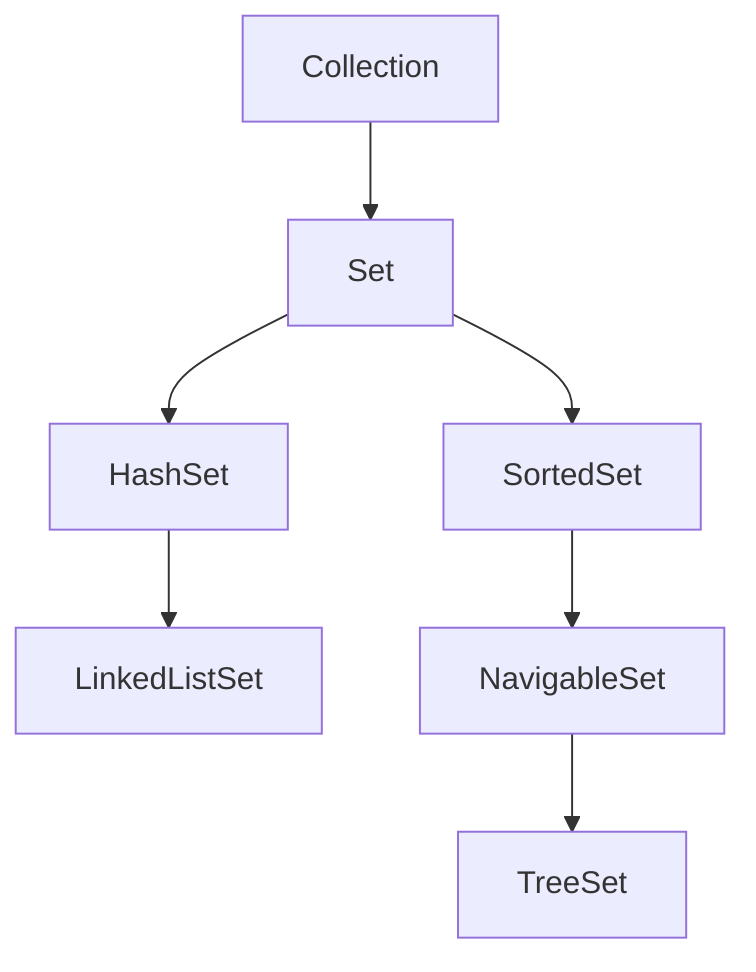
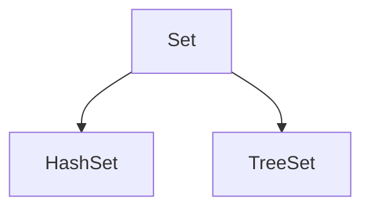

# JavaCollectionFramework
This is all about Java Collection.


<h3> <i> java.util </i> →Package contains  the collection classes let us to group elements in various ways . The Collection Classes also define several methods that provide easier way of working with items . These classes are important , not just for their but because many other Java methods use or return objects of these classes such as the <i>ArrayList</i> and <i>HashMap</i> classes. Collection package added to JSE 1.2 Java SE 8 has significantly increased the power and streamlined the use of collection framework. </h3>

<h2> <ins> The Collection Framework Interfaces </ins></h2>
<ul>
  <li><h3>1.Collection</h3> </li>
  <li><h3>2.Deque</h3> </li>
  <li><h3>3.List</h3> </li>
  <li><h3>4.Set</h3> </li>
  <li><h3>5.Map</h3> </li>
  <li><h3>6.Sorted Set</h3> </li>
  <li><h3>7.Sorted Map</h3> </li>
  <li><h3>8.Queue</h3> </li>
  <li><h3>9.Navigable Set</h3> </li>
</ul>

<h2> <ins>1. The Collection Interface </ins> </h2>

<br>
  
```Syntax

Collection: It is the top of the collection hierarchy. It supports basic grouping of elements.

```
<ul>
<ul>
<h3><a href= "https://github.com/AvinandanBose/JavaCollectionFramework/blob/main/javacollection1.java" > Java Collection [Eg -1]</a></h3>
<h3><a href= "https://github.com/AvinandanBose/JavaCollectionFramework/blob/main/javacollection2.java" > Java Collection [Eg -2]</a></h3>
<h3><a href= "https://github.com/AvinandanBose/JavaCollectionFramework/blob/main/javacollection3.java" > Java Collection [Eg -3]</a></h3>
<h3><a href= "https://github.com/AvinandanBose/JavaCollectionFramework/blob/main/javacollection4.java" > Java Collection [Eg -4]</a></h3>
</ul>

<table>
 <tr>
    <th>Interface</th>
    <th>Hash Table</th>
    <th>Resizable Array</th> 
   <th>Balanced Tree</th> 
   <th>Linked List</th> 
</tr> 
<tr>
  <td >Collection</td>
  <td >HashSet</td> 
  <td >ArrayList</td> 
  <td >TreeSet</td>
  <td >Linked List</td>
</tr>
</table>
  
<h3>  
 
```Syntax

That is we can create an instance of HashSet, ArrayList, TreeSet 
and LinkedList Class,through the help of Collection interface.


```

<h2> <ins> 2 . Sets </ins></h2>  
  
  


  ```Syntax

Collection: It is the top of the collection hierarchy. It supports basic grouping of elements.
  
Set: It extends Collection to implement sets, in which all elements must be unique.
  
SortedSet: It extends Set to implement a sorted set.
  
HashSet:  It extends Set to implement a hash set.

LinkedListSet:   It extends HashSet to implement a Linked List Set.

NavigableSet:   It extends SortedSet to implement a Navigable Set.
  
Tree Set:   It extends NavigableSet to implement a Tree Set.
```


  
<table>
 <tr>
    <th>Interface</th>
    <th>Hash Table</th>
    <th>Resizable Array</th> 
   <th>Balanced Tree</th> 
   <th>Linked List</th> 
</tr> 
<tr>
  <td >Set</td>
  <td >HashSet</td> 
  <td ></td> 
  <td >TreeSet</td>
  <td ></td>
</tr>
</table>  

<ul>
<h3><a href= "https://github.com/AvinandanBose/JavaCollectionFramework/blob/main/setDemo.java" > Set→HashSet [Eg -1]</a></h3>
<h3><a href= "https://github.com/AvinandanBose/JavaCollectionFramework/blob/main/setDemo1.java" >  Set→TreeSet  [Eg -2]</a></h3>


```Syntax

That is we can create an instance of TreeSet, HashSet,
through the help of Set Interface.

:HashSet:
___________
→It implements Set Interface.
→ Every elements entered are unique i.e. No duplicates.
→ HashSet stores the elements by using a mechanism called hashing.
→ HashSet allows null value.
→ HashSet doesn't maintain the insertion order. 
  Here, elements are inserted on the basis of their hashcode.
  
:TreeSet:
___________
→It implements Set Interface.
→TreeSet class access and retrieval times are quiet fast.
→TreeSet class doesn't allow null element.
→TreeSet class maintains ascending order. 
→TreeSet class contains unique elements only like HashSet.
```

<h2> Calculation of HashCode  </h3>
<ul>
<li><h3> 1. Integers </h3> </li>
<ul>
<h3><a href= "https://github.com/AvinandanBose/JavaCollectionFramework/blob/main/hashcodeDemo1.java" > HashCode Of Integers [Eg -1]</a></h3>
</ul>
<li><h3> 2. Strings </h3> </li>
<ul>
<h3><a href= "https://github.com/AvinandanBose/JavaCollectionFramework/blob/main/hashcodeDemo2.java" > HashCode Of Strings [Eg -2]</a></h3>
</ul>


```Syntax

:HASH CODE OF INTEGERS:

HASH CODE OF 1 → 1
HASH CODE OF 2 → 2
HASH CODE OF 3 → 3

                  ......etc.
                  
:HASH CODE OF STRINGS:

HASH CODE OF A → 65 //ASCII CODE
HASH CODE OF B → 66 //ASCII CODE
HASH CODE OF C → 67 //ASCII CODE
                    ......etc.

```
</ul>
  
<h1>  HashSet Functionality:  </h1>
 <ul>
   <li> <h3> 1. Add </h3> </li>
   <ul>
     <h3><a href= "https://github.com/AvinandanBose/JavaCollectionFramework/blob/main/HashSetDemo.java" > HashSet [Add]</a></h3>
    </ul>
    <li> <h3> 2. Remove </h3> </li>
   <ul>
     <h3><a href= "https://github.com/AvinandanBose/JavaCollectionFramework/blob/main/HashSetDemo1.java" > HashSet [Remove]</a></h3>
    </ul>
    <li> <h3> 3. Clear </h3> </li>
   <ul>
     <h3><a href= "https://github.com/AvinandanBose/JavaCollectionFramework/blob/main/HashSetDemo2.java" > HashSet [Clear]</a></h3>
    </ul>
   <li> <h3> 4. Clone </h3> </li>
   <ul>
     <h3><a href= "https://github.com/AvinandanBose/JavaCollectionFramework/blob/main/HashSetDemo3.java" > HashSet [Clone]</a></h3>
    </ul>
     <li> <h3> 5. Iterator </h3> </li>
   <ul>
     <h3><a href= "https://github.com/AvinandanBose/JavaCollectionFramework/blob/main/HashSetDemo4.java" > HashSet [Iterator]</a></h3>
     <ul>
     <li><h3>a. HashSet [Iterator] → For Each Remaining</a></h3></li>
     <ul>
        <li><h3><a href= "https://github.com/AvinandanBose/JavaCollectionFramework/blob/main/HashSetDemo5.java" > For Each Remaining</a></h3></li>
     </ul>
      <li><h3>b. HashSet [Iterator] → hasNext</a></h3></li>
     <ul>
        <li><h3><a href= "https://github.com/AvinandanBose/JavaCollectionFramework/blob/main/HashSetDemo6.java" > hasNext</a></h3></li>
     </ul>
     <li><h3>c. HashSet [Iterator] →Next</a></h3></li>
     <ul>
        <li><h3><a href= "https://github.com/AvinandanBose/JavaCollectionFramework/blob/main/HashSetDemo7.java" > Next</a></h3></li>
     </ul>
     <li><h3>c. HashSet [Iterator] →remove</a></h3></li>
     <ul>
        <li><h3><a href= "https://github.com/AvinandanBose/JavaCollectionFramework/blob/main/HashSetDemo8.java" > Remove</a></h3></li>
     </ul>
    </ul>
    </ul>
    


  </ul>
</ul>

</h3>

</ul>
